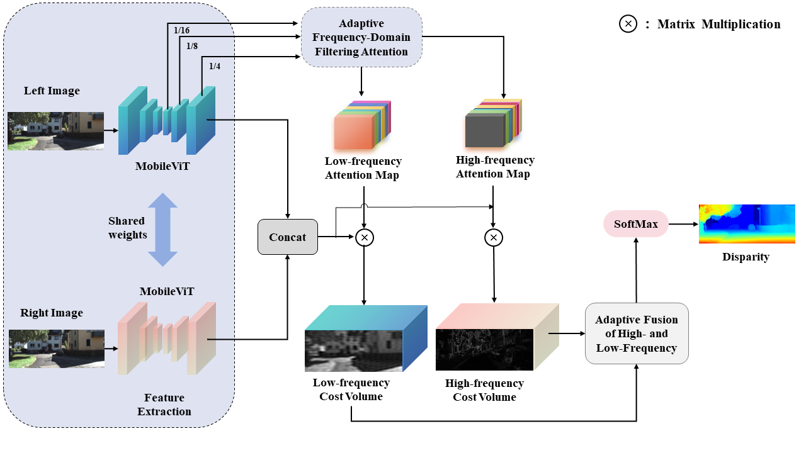

# 🚀 MAFNet🚀 
MAFNet: Multi-frequency-Adaptive-Fusion-Network-for-Real-time-Stereo-Matching

# Abstract
Existing stereo matching networks typically rely on either cost-volume construction based on 3D convolutions or deformation methods based on iterative optimization. The former incurs significant computational overhead during cost aggregation, whereas the latter often lacks the ability to model non-local contextual information. These methods exhibit poor compatibility on resource-constrained mobile devices, limiting their deployment in real-time applications. To address this, we propose a Multi-frequency Adaptive Fusion Network (MAFNet), which can produce high-quality disparity maps using only efficient 2D convolutions. Specifically, we design an adaptive frequency-domain filtering attention module that decomposes the full cost volume into high-frequency and low-frequency volumes. Subsequently, we introduce a Linformer-based low-rank attention to adaptively aggregation high- and low-frequency information, yielding more robust disparity estimation. Extensive experiments demonstrate that the proposed MAFNet significantly outperforms existing real-time methods on public datasets such as Scene Flow and KITTI 2015, showing a favorable balance between accuracy and real-time performance. 

